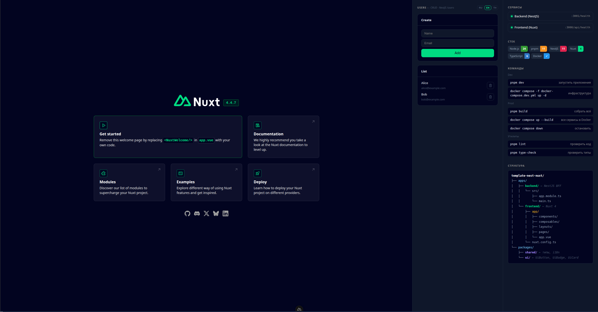

# template-nest-nuxt

Переиспользуемый шаблон монорепозитория NestJS + Nuxt 4, завёрнутый в Docker


📖 [Архитектура](docs/architecture.md) · 🗄️ [База данных](docs/database.md)



## Варианты

| Ветка             | Описание                  |
| ----------------- | ------------------------- |
| `main`            | Базовый шаблон — без БД   |
| `postgres-prisma` | + PostgreSQL + Prisma ORM |

```bash
# базовый вариант
git clone https://github.com/CyberPunk10/template-nest-nuxt-docker.git

# с PostgreSQL и Prisma
git clone -b postgres-prisma https://github.com/CyberPunk10/template-nest-nuxt-docker.git
```

---

## Структура

```
template-nest-nuxt/
├── apps/
│   ├── backend/        ← NestJS API (:3001)
│   └── frontend/       ← Nuxt 4 (:3000)
├── packages/
│   ├── shared/         ← @repo/shared — общие типы и i18n переводы
│   └── ui/             ← @repo/ui — общие Vue компоненты
└── ...конфиги монорепо
```

---

## Что настроено

### Монорепо

- **pnpm workspaces** — общие зависимости
- **TypeScript strict** — строгий режим, path alias `@repo/*`
- **ESLint + Prettier** — единый форматтер для всего монорепо
- **Husky + lint-staged** — проверка изменённых файлов перед коммитом

### Пакеты

- **@repo/shared** — общие TypeScript типы (DTO) и i18n переводы (ru/en/th)
- **@repo/ui** — библиотека Vue компонентов (`UiButton`, `UiBadge`, `UiCard`)
- **Proxy** — Nuxt server route проксирует `/api/backend/*` → NestJS, без CORS в dev
- **Users CRUD** — полный REST на бекенде (`GET/POST/PUT/DELETE /users`), UI на фронтенде

### Backend

- **Swagger/OpenAPI** — интерактивная документация API с возможностью тестировать запросы прямо в браузере. Доступна только в dev на `http://localhost:3001/api/docs`, в production не монтируется
- **Exception filter** — глобальный перехватчик ошибок: клиент всегда получает единообразный JSON, непредвиденные ошибки (`500`) логируются через NestJS Logger со stack trace
- **ValidationPipe** — автоматическая валидация тела запросов через DTO: лишние поля отклоняются с `400`, типы приводятся автоматически
- **Joi** — валидация переменных окружения при старте приложения: если обязательная переменная отсутствует или имеет неверный тип — сервис не запустится с понятной ошибкой

### Инфраструктура

- **Docker** — multi-stage образы для backend и frontend
- **docker compose** — dev и prod режимы

---

## Запуск

### Локально (dev)

Основной режим разработки — hot reload, быстрый старт:

```bash
pnpm install
pnpm dev
```

- Frontend: http://localhost:3000
- Backend: http://localhost:3001

Когда появятся внешние зависимости (БД, другие сервисы) — поднимай только их через Docker, приложения оставляй локальными:

```bash
docker compose -f docker-compose.dev.yml up -d   # только инфраструктура
pnpm dev                                          # приложения локально
```

### Локально (prod-сборка)

Проверить production-сборку без Docker:

```bash
pnpm build

# запустить backend
cd apps/backend && pnpm start:prod

# запустить frontend (в другом терминале)
cd apps/frontend && node .output/server/index.mjs
```

### Docker — оба сервиса

Собрать образы и поднять всё одной командой:

```bash
docker compose up --build
```

- Frontend: http://localhost:3000
- Backend: http://localhost:3001

Остановить:

```bash
docker compose down
```

### Docker — только backend

```bash
docker build -f apps/backend/Dockerfile -t my-backend .
docker run -p 3001:3001 -e PORT=3001 -e CORS_ORIGIN=http://localhost:3000 my-backend
```

### Docker — только frontend

```bash
docker build -f apps/frontend/Dockerfile -t my-frontend .
docker run -p 3000:3000 -e BACKEND_URL=http://localhost:3001 my-frontend
```

> **Важно:** при запуске контейнеров по отдельности они не видят друг друга по имени сервиса.
> Если нужно чтобы frontend достучался до backend — создай общую сеть вручную:
>
> ```bash
> docker network create my-app
> docker run -p 3001:3001 --network my-app --name backend my-backend
> docker run -p 3000:3000 --network my-app -e BACKEND_URL=http://backend:3001 my-frontend
> ```

---

## Прочие команды

```bash
pnpm install        # установить зависимости
pnpm dev            # запустить всё параллельно
pnpm build          # собрать все workspace'ы
pnpm lint           # проверить линтером
pnpm type-check     # проверить типы
```

- Frontend: http://localhost:3000
- Backend API: http://localhost:3001
- Backend health: http://localhost:3001/health
